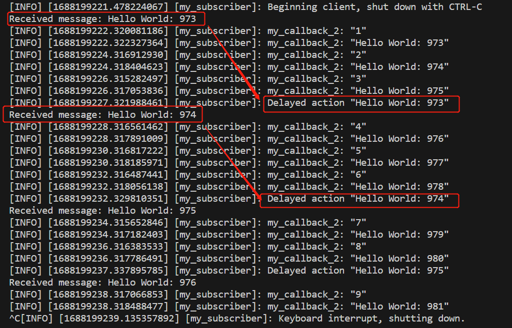
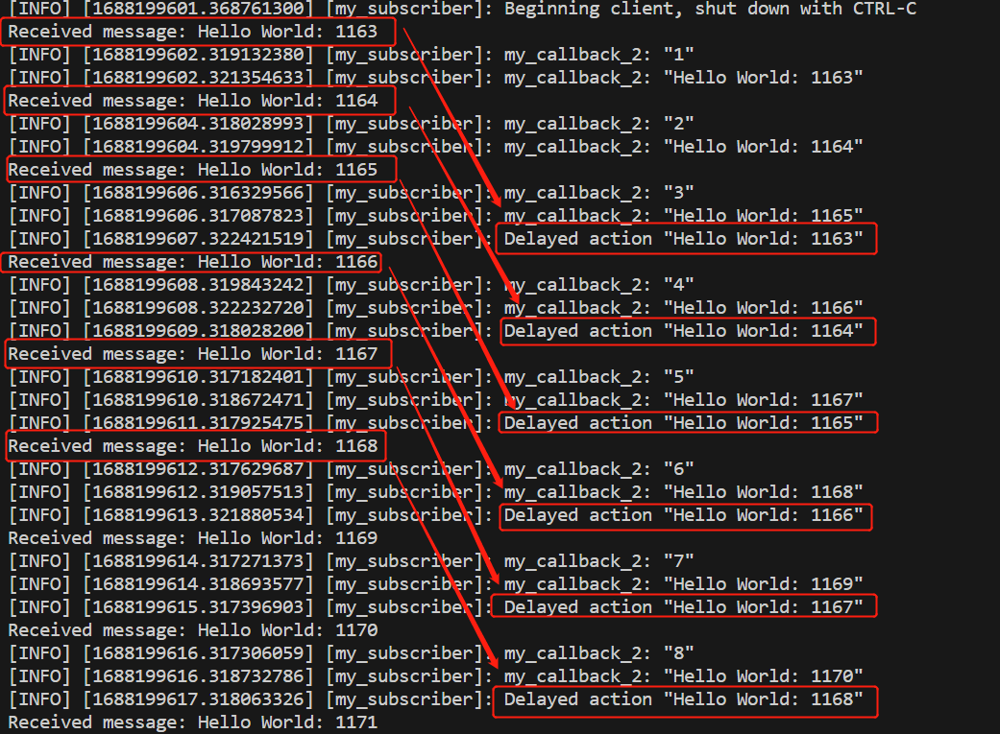

# python_study  

## pub  
ros2 基础的pub节点  
发布消息（测试用）  

## ros2多线程回调
rclpy库和asyncio库在事件循环上有冲突，因此无法直接在ROS2的回调函数中使用asyncio.sleep()  

经常会遇到如下现象  
[ros2_sub_problem_recurrence](./ros2_sub_problem_recurrence.py) 
在单线程的情况下，`当一个回调函数被阻塞时，其他回调函数也将无法执行，直到阻塞的回调函数完成`。因此，如果my_callback函数的执行时间很长，它会阻塞整个节点的运行，从而导致其他回调函数（包括my_callback_2）无法及时响应消息。如果需要同时处理多个回调函数或避免阻塞，可以考虑使用`多线程`或`异步`编程技术。  
`ROS（机器人操作系统）中的一个节点通常是一个单线程的执行单元`。每个节点在自己的线程中独立运行，并与其他节点进行通信。这种设计可以确保节点之间的数据交换和处理的实时性和可靠性。然而，也可以使用多线程来实现多个并发任务，但在节点级别上，默认情况下是单线程的。请注意，具体的实现方式可能会根据节点的需求和开发者的选择而有所不同。  
或启两个节点，这两个节点共同操作同一个变量，可以使用ROS参数服务器（Parameter Server）来实现。ROS参数服务器是一个全局存储空间，可以在不同的节点之间共享数据。  

此时如果想实现以下效果  
`callback1 在执行过程中使用callback2获取的当前（较新的）数据时，可以延迟执行callback1中的部分内容。`

### CallbackGroup
[ROS2-Using-callback-groups](https://docs.ros.org/en/galactic/How-To-Guides/Using-callback-groups.html)  
当面对只有一个node节点时，程序的调用是线性的,此时可以使用使用执行器和回调组完成多线程的创建。  
- `MutuallyExclusive`；互斥，即这个组别中每时刻只允许1个线程，一个callback在执行时，其他只能等待  
- `Reentrant`；可重入，这个组别中每时刻允许多个线程，一个Callback在执行时，其他callback可开启新的线程  

这样我们可以有效地对ROS2中的callback程序进行控制。在ROS2的node中默认组别是MutuallyExclusive类型，即便使用了multiThreadedExecutor，也依然默认MutuallyExclusive类型，所以我们可以按照我们的需求来进行设置。  
##### 执行方式
- 互斥回调组防止其回调 并行执行 - 本质上使组中的回调变得好像 由单线程执行器执行。  
- 重入回调组允许执行者调度和执行 该组以它认为合适的任何方式进行回调，不受限制。 这意味着，除了并行运行不同的回调之外 彼此之间，同一回调的不同实例也可能是 同时执行。  
- 属于不同回调组（任何类型）的回调始终可以 彼此并行执行。  
##### 控制执行
- 注册不应与同一回调并行执行的回调 互斥回调组。 一个示例案例可能是回调正在访问共享 关键和非线程安全资源。

- 如果您有一个回调，其执行实例需要能够重叠 彼此之间，将其注册到可重入回调组。 一个示例案例可能是需要能够处理的操作服务器 多个操作调用彼此并行。

- 如果您有可能需要执行的不同回调 彼此并行，将它们注册到
    - 可重入回调组，或
    - `不同的互斥回调组`（此选项很好，如果您 希望回调不重叠或也需要线程 关于其他一些回调的安全性） 或任何类型的不同回调组（根据选择类型 到其他标准）。

#### MutuallyExclusive互斥回调组
[ros2_sub_MutuallyExclusiveCallbackGroup](./ros2_sub_MutuallyExclusiveCallbackGroup.py)  
此处使用`不同的互斥回调组，即可完美解决上述问题`，具体实现参考👆
##### `创建不同的互斥回调组的方法`
```python
my_cb_group_1 = MutuallyExclusiveCallbackGroup()
my_cb_group_2 = MutuallyExclusiveCallbackGroup()
```
```python
my_cb_group_1 = MutuallyExclusiveCallbackGroup()
my_cb_group_2 = None
```
其具体实现效果如下所示：  

如图所示，callback_1的回调执行被阻塞，但callback_2的执行完全不受影响。

#### ReentrantCallbackGroup可重入回调组
[ros2_sub_ReentrantCallbackGroup](./ros2_sub_ReentrantCallbackGroup.py)  
可重入回调组的运行结果，与不同的互斥有所区别。
根据如下运行结果，可明显看到差异。

如图所示，callback_2仍不受callback_1的干扰。而`两者的区别在于，再可重入下，callback_1的回调创建了多个线程，而互斥回调组下，仍保持一个线程`。  

### ros2_sub_delay_exe  
此处使用ros2的`定时器`方法，实现`延迟执行`  
[ros2_sub_delay_exe](./ros2_sub_delay_exe.py)  

```python
timer = self.create_timer(1.0, self.delayed_action)
```
create_timer() 是Node类的一个方法，用于创建一个定时器。  
当定时器被创建后，它会以指定的时间间隔周期性地触发，然后调用所设置的回调函数self.delayed_action。你可以在delayed_action() 方法中编写执行操作的代码，这些操作将在每次定时器触发时执行。  

使用定时器可以很方便地实现在指定的时间间隔后执行某些操作，而`不必阻塞主循环`。这对于处理需要按照特定时间间隔执行的任务非常有用，例如周期性地发布消息或执行传感器读取等操作。  

当回调函数callback()被调用时，它会执行一些操作（如打印消息）后，创建一个新的定时器self.timer。定时器将以1秒的时间间隔周期性地触发，并调用回调函数self.delayed_action。这个定时器是在每个回调函数中动态地创建的，所以每个回调函数都有自己独立的定时器实例。  

`一旦回调函数执行完毕，定时器就会被释放。`这是因为定时器的生命周期与回调函数的生命周期绑定在一起：它们是在同一个作用域内定义的并且没有被存储为类成员变量。一旦回调函数完成执行，定时器不再被引用，它的相关资源将被自动释放。  